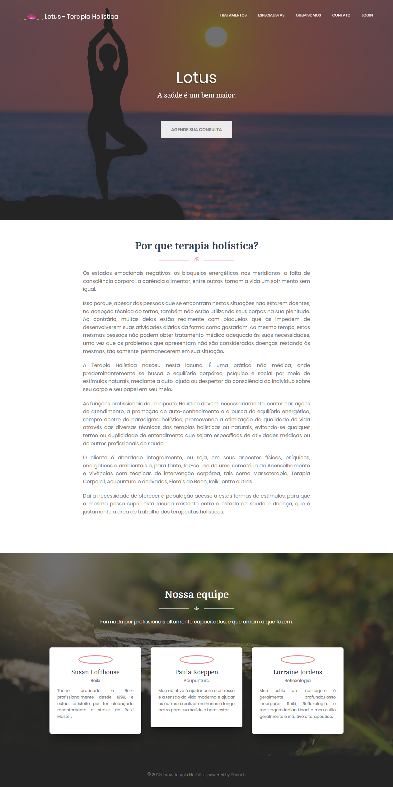

# Projeto da Terapia Holística

Projeto criado na matéria de programação funcional da Fatec. Desenvolvido com Yesod, uma framework web baseada em Haskell.
Atualmente ainda não conta com todas as funcionalidades idealizadas, é um trabalho em progresso.

## Up and Running
Clonar o repositório:

	git clone https://github.com/ProjetoDaTerapiaHolistica/projetosite.git
Após isso, ajuste as configurações de banco de dados: 

	/config/settings.yml

Caso você ainda não tenha criado, sugiro criar uma instância de PostgreSQL no Heroku. 
Com tudo configurado, execute o script **exec**.sh

### Pré-requisito

Você necessita instalar o [Haskell Stack](https://haskell-lang.org/get-started) e realizar os passos descritos no [Quick start do Yesod](https://www.yesodweb.com/page/quickstart)

## Construído com:

* [Haskell](https://www.haskell.org/) - Linguagem de programação puramente funcional
* [Yesod](https://www.yesodweb.com/) - Framework web Haskell para desenvolvimento produtivo de aplicações web de alto desempenho, RESTful e de alta qualidade.
* [PostgreSQL](https://www.postgresql.org/) - Sistema gerenciador de banco de dados objeto relacional, desenvolvido como projeto de código aberto.

## Contribuições

Aceito.

## Autores

* **Thamyres Santos** - *Modelagem do arquivo models inicial*  
* **André Pinto** - *Diversas coisas*

## License

Esse projeto é licenciado utilizando a Non-Profit Open Software License 3.0 (NPOSL-3.0). Leia o arquivo [LICENSE.md](LICENSE.md) para detalhes.

## Agradecimentos

Sem eles, eu não teria feito esse projeto:

* Thamyres Santos
* João Vitor
* Patrick, monitor de Haskell

## Screenshot

